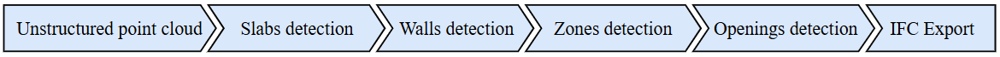

# Cloud2BIM 

> **Note:** An advanced version of this software, **Cloud2BIM-AI**, is now available through **Constriq**, a ČVUT spin-off. It offers **higher robustness**, **lower computational time**, **more recognized elements**, and **continuous development**. Visit [constriq.tech](https://constriq.tech/) for more information.

Cloud2BIM automates the Scan-to-BIM process by converting point clouds into 3D parametric entities.  It employs a segmentation algorithm that utilizes point cloud density analysis, augmented by image and morphological operations. This allows the software to precisely extract the geometry of building elements such as slabs, walls, windows, and doors. The output is generated in IFC format, ensuring compatibility with other OpenBIM tools. The primary motivation for this software is to streamline and enhance decision-making at the end of a building's lifecycle, leading to more efficient material use during demolition or deconstruction.

# Installation
To install Cloud2BIM, follow these steps:
git clone 

https://github.com/VaclavNezerka/Cloud2BIM.git

Install dependencies:

First, ensure you have Python and pip installed.
Then, install the required dependencies listed in the requirements.txt file:

pip install -r requirements.txt

# Running the Script
The `cloud2entities.py` script requires a YAML configuration file to run. You can provide the path to the 
configuration file as a command-line argument. If no argument is provided, the script will 
automatically use the default file `config.yaml`.

### Example command

python cloud2entities.py config.yaml

### Dataset
The complete original point cloud for Kladno station is available at Zenodo platform.

https://zenodo.org/records/14221915

## Citation

If you find this project or any part of it useful in your research or work, please consider citing the following article:

@article{Cloud2BIM_2025,
    title = {Open-source automatic pipeline for efficient conversion of large-scale point clouds to IFC format},
    journal = {Automation in Construction},
    volume = {177},
    pages = {106303},
    year = {2025},
    issn = {0926-5805},
    doi = {https://doi.org/10.1016/j.autcon.2025.106303},
    author = {Slávek Zbirovský and Václav Nežerka},
}

# License
MIT License
